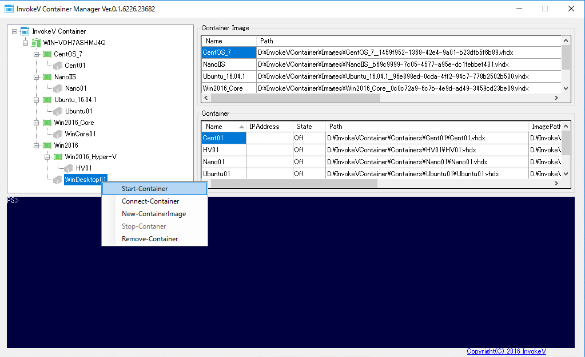

# InvokeV Container

InvokeV Container は使い慣れたHyper-V上でコンテナと同様に、より速く、より小さくを実現する新しい仮想マシンの利用方法を提案します。  

## 特徴：
* 作る、破棄する、イメージ化して再利用のサイクルを簡単に実現。
* コンテナ自体のファイルはvhdxの差分ファイルを利用することで最小限に。
* Windows、NanoServer、LinuxなどHyper-VがサポートしているOSが利用可能。
* NanoServerのイメージを利用することで、より速く、より小さくを実現。
* Hyper-V上のネットワーク、セキュリティーなど仮想マシンと同様の仕様で利用が可能。
* 既存の仮想マシンとHyper-V上で混在利用が可能。
* コンテナイメージを自身で作成。
* PowerShellと、GUIツールでの管理が可能。
* リモートデスクトップによるGUI操作が可能。
* 親のコンテナイメージとの結合して新しいイメージとして保存が可能。
* Windows コンテナ、Dockerコンテナとは互換性はありません。

## 要件：
Windows Server 2016 Hyper-V  
Windows Server 2012 R2 Hyper-V  
  
  
## インストール：
 [InvokeVContainer.psm1](/InvokeVContainer.psm1) と [Setup.ps1](/Setup.ps1) を同一のフォルダにダウンロードします。  
  
 ダウンロードしたスクリプトでセキュリティー警告が出る場合があるので、スクリプトをアンロックします。  
 
    PS C:\Users\Administrator\Downloads> Unblock-File .\Setup.ps1   
     
レポジトリを作成するパスを指定してSetup.ps1 を実行します。  

    PS C:\Users\Administrator\Downloads> .\Setup.ps1 "D:\"

指定したパス配下に「InvokeVContainer」フォルダ（この場合はD:\InvokeVContainer）が作成され、InvokeVContainer.psm1ファイルが、「C:\Users\Administrator\Documents\WindowsPowerShell\Modules\InvokeVContainer\InvokeVContainer.psm1」にコピーされます。（Administratorでログインしている場合）  

※Windowsコンテナの「Docker-PowerShell」のPowerShellモジュールがインストールされている場合は、Uninstall-Module Docker および、Remove-Module Docker　を実行してDocker-PowerShellを削除する必要があります。  
※InvokeVContainer.psm1に変更を加えた場合は、「Remove-Module *」を実行してモジュールの再読み込が必要です。  
※アンインストールは レポジトリフォルダと、InvokeVContainer.psm1を削除します。  
  
  
## コマンドの確認： 

    > Get-Command -Module InvokeVContainer

    CommandType     Name                                               Version    Source                         
    -----------     ----                                               -------    ------                         
    Function        Correct-ContainerImage                             0.0        InvokeVContainer               
    Function        Export-ContainerImage                              0.0        InvokeVContainer               
    Function        Get-Container                                      0.0        InvokeVContainer               
    Function        Get-ContainerImage                                 0.0        InvokeVContainer               
    Function        Get-ContainerIPAddress                             0.0        InvokeVContainer               
    Function        Get-InvokeVContanerRoot                            0.0        InvokeVContainer               
    Function        Get-TreeView                                       0.0        InvokeVContainer               
    Function        Import-ContainerImage                              0.0        InvokeVContainer               
    Function        Merge-ContainerImage                               0.0        InvokeVContainer               
    Function        New-Container                                      0.0        InvokeVContainer               
    Function        New-ContainerImage                                 0.0        InvokeVContainer               
    Function        Remove-Container                                   0.0        InvokeVContainer               
    Function        Remove-ContainerImage                              0.0        InvokeVContainer               
    Function        Run-Container                                      0.0        InvokeVContainer               
    Function        Set-ContainerIPConfig                              0.0        InvokeVContainer               
    Function        Set-TreeView                                       0.0        InvokeVContainer               
    Function        Start-Container                                    0.0        InvokeVContainer               
    Function        Stop-Container                                     0.0        InvokeVContainer               
    Function        Wait-ContainerBoot                                 0.0        InvokeVContainer               
  
  
## 最初のコンテナイメージ：
コンテナイメージとなるのは、OSがインストール済みの仮想マシンのvhdxファイルです。イメージとしてインポートを実行します。  

    > Import-ContainerImage -FilePath "D:\Hyper-V\Win2016\Win2016.vhdx"

vhdxファイルにGUIDを割当てたファイルが、「D:\InvokeVContainer\Images」にコピーされます。（ファイルサイズによってはしばらく時間がかかります。）   
  
  
## コンテナイメージの確認：

    > Get-ContainerImage

    Name       : IMG_01
    Path       : D:\InvokeVContainer\Images\IMG_01_2110bc02-d624-4c78-879b-dd6f5601fabc_1d0ac088-4547-4a49-bfa5-7f542e08a386.vhdx
    Size(MB)   : 1947
    Created    : 2017/01/16 21:49:01
    ParentPath : D:\InvokeVContainer\Images\Win2016__2110bc02-d624-4c78-879b-dd6f5601fabc.vhdx

    Name       : MyNewIMG_01
    Path       : D:\InvokeVContainer\Images\MyNewIMG_01__ac2e69c7-c406-42a3-a0a9-b7d6cbc8f116.vhdx
    Size(MB)   : 18308
    Created    : 2016/10/13 12:09:56
    ParentPath : 

    Name       : Win2016
    Path       : D:\InvokeVContainer\Images\Win2016__2110bc02-d624-4c78-879b-dd6f5601fabc.vhdx
    Size(MB)   : 18308
    Created    : 2016/10/13 12:09:56
    ParentPath : 
  
  
## 最初のコンテナの作成：

    > New-Container -ContainerName "CON_01" -ImageName "Win2016" -Memory 2048MB -Processer 1 -SwitchName "NAT"

-SwithName　で指定する仮想スイッチはあらかじめHyper-Vマネージャーで作成したものを指定しています。  
New-NetNatコマンドで作成したNAT仮想スイッチも利用できますが、IPアドレスは個別に割り当てる必要があります。  

    > Run-Container -ContainerName "CON_01" -ImageName "Win2016" -Memory 2048MB -Processer 1 -SwitchName "NAT" -IPAddress 172.16.0.1 -Subnet 255.255.255.240 -Gateway 172.16.0.254 -DNS 8.8.8.8

Run-Containerコマンドを使うと、コンテナの作成〜起動〜IPアドレスの設定まで一度に行うことができます。  
※IPアドレスの割当はコンテナイメージのOSが統合サービスに対応している場合のみ。  　
  
  
## コンテナの確認：

    > Get-Container

    Name     State Path                                              ParentPath                                                                   
    ----     ----- ----                                              ----------                                                                   
    CON_01 Running D:\InvokeVContainer\Containers\CON_01\CON_01.vhdx D:\InvokeVContainer\Images\Win2016__2110bc02-d624-4c78-879b-dd6f5601fabc.vhdx
  
  
## コンテナの起動：

    > Start-Container "CON_01" 
  
  
## コンテナの停止：

    > Stop-Container "CON_01" 
  
  
## コンテナに接続：

    > vmconnect (hostname) "CON_01" 

Hyper-Vマネージャーからと同様に、vmconnext.exe を利用してコンテナに接続します。  
    
  
## 最初のコンテナイメージの作成：

    > New-ContainerImage -ContainerName "CON_01" -ImageName "IMG_01" 

作成したコンテナからコンテナイメージを作成します。  
コンテナが起動中でも、停止中でもコンテナイメージを作成することが可能です。  
作成されたコンテナイメージは、コンテナの親イメージファイルの子ファイル（差分ファイル）となっています。  
新しく作成されたコンテナイメージから、さらにコンテを作成、コンテナイメージを作成・・・  
  
  
## コンテナイメージの結合：

    > Merge-ContainerImage -ImageName "IMG_01" -NewImageName "MyNewIMG_01"
 
親子関係のコンテナイメージファイルを結合して、新しいコンテナイメージを作成します。  
結合前の親子ファイルは削除されず、関連したコンテナもそのまま残されます。  
  
  
## コンテナイメージの削除：

    > Remove-ContainerImage "IMG_01"
  
  
## InvokeV Container Manager：
[InvokeV Container Manager](/InvokeVContainerManager.exe) は、PowerShellのコマンドをGUIを使って実行することで、視覚的にコンテナの操作管理が可能となります。  
コンテナでは、ファイルの親子関係が多岐にわたるため、構成を把握するためにも有用なツールとなっています。  
基本的な操作はアイコンをマウスの右クリックしてから始めるようになっています。  
※管理者権限にて実行する必要があります。

## InvokeV Container Overview：
[InvokeV Container Overview (YouTube)](https://youtu.be/FElIdcLgcdY)  